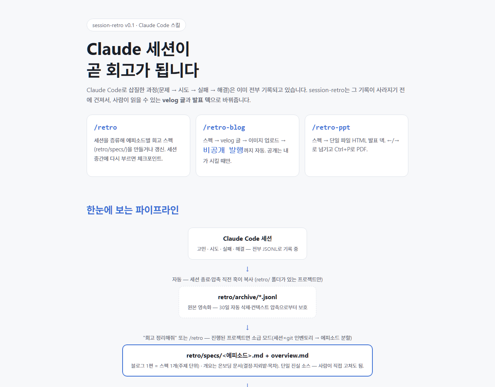
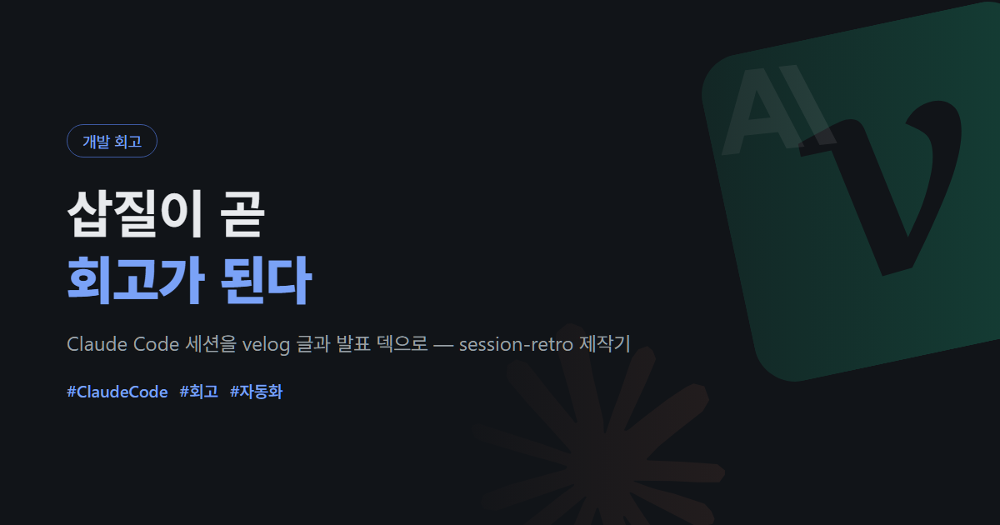
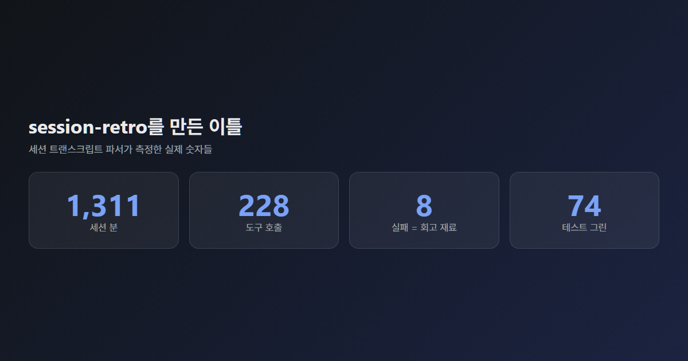
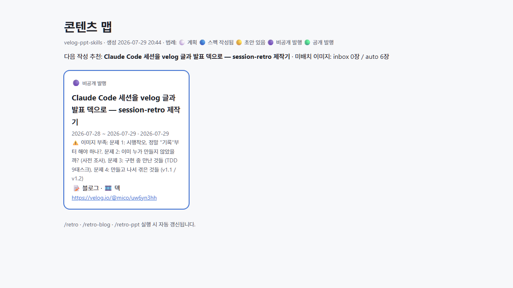

# session-retro

**Claude Code 세션이 곧 회고가 됩니다.** 세션 속 시행착오(문제→시도→실패→해결)를 증류해
**velog 블로그**(비공개 발행·이미지 자동 생성)와 **단일 파일 HTML 발표 덱**으로 내보내는 스킬 모음.

*Turn your Claude Code sessions into retrospective blog posts (velog) and HTML slide decks — trial-and-error included, images auto-generated.*

[](https://skills.sh/sionhyeop/session-retro)



> 📖 **처음이라면 도식 가이드부터**: [`docs/index.html`](docs/index.html)을 브라우저에서 여세요
> (외부 의존성 없는 단일 파일 — GitHub Pages: 저장소 설정에서 `docs/`로 켜면 그대로 사이트가 됩니다).

## ⚡ 3분 시작

① 설치 — 둘 중 편한 쪽으로:

```bash
# 방법 A. Claude Code 플러그인 (권장)
claude plugin marketplace add sionhyeop/session-retro
claude plugin install session-retro

# 방법 B. 직접 설치
git clone https://github.com/sionhyeop/session-retro && cd session-retro && bash install.sh

# 방법 C. skills CLI — Claude Code 외에 Codex·Cursor 등 70+ 에이전트 지원
npx skills add sionhyeop/session-retro
```

> 방법 C는 스킬만 설치됩니다(자동 백업·넛지 훅 제외) — 훅까지 원하면 A 또는 B를 쓰세요.

② 그다음, 회고를 남기고 싶은 프로젝트의 Claude Code에서:

```
지금까지 한 거 회고로 정리해줘        ← /retro : retro/spec.md 생성
이거 velog에 올려줘                  ← /retro-blog : 초안 작성 → 비공개 발행 업로드
발표자료로도 만들어줘                ← /retro-ppt : HTML 덱 생성
```

③ 결과물 위치: `retro/out/blog/*.md` (velog에 **비공개로 발행**됨 — "공개로 바꿔줘" 하면 공개 전환), `retro/out/ppt/*.html` (더블클릭 → 발표, Ctrl+P → PDF), `retro/map.html` (**콘텐츠 맵** — 에피소드별 진행 상태 색칠, 이미지 부족 경고, 다음 작성 추천. 스킬 실행 때마다 자동 갱신)

`/retro`를 한 번 실행해 `retro/` 폴더가 생긴 프로젝트는, 이후 세션 종료·컨텍스트 압축 시
트랜스크립트가 `retro/archive/`에 **자동 백업**됩니다 (opt-in 방식 — 다른 프로젝트는 건드리지 않음).

## 결과물 미리보기

전부 이 스킬이 실데이터로 자동 생성한 것들입니다 (AI 일러스트 없음):

| 썸네일 타이틀 카드 | 스탯 카드 |
|---|---|
|  |  |


*콘텐츠 맵 — 에피소드별 진행 상태(⚪🔵🟡🟣🟢)와 이미지 부족 경고, 다음 작성 추천*

## 이렇게 말하면 됩니다

슬래시 명령을 외울 필요 없습니다 — 자연어로 트리거됩니다.

| 하고 싶은 것 | Claude에게 이렇게 | 일어나는 일 |
|---|---|---|
| 세션 정리 | "회고 정리해줘" / `/retro` | `retro/spec.md` 생성·갱신 + 이미지 배치 제안 |
| 중간 저장 | "체크포인트 찍어줘" | spec에 이후 진행분 병합 (실시간 중간 정리) |
| 블로그 | "velog에 올려줘" / `/retro-blog` | 초안 작성 → 승인 → 이미지 CDN 업로드 → **비공개 발행** |
| 공개 전환 | "공개로 바꿔줘" | 비공개로 발행된 글을 공개로 전환 ("비공개로 돌려줘"도 가능) |
| 발행 후 수정 | "글 고쳐서 업데이트해줘" | 스펙/초안 수정 → 발행된 글 갱신 (공개 상태·시리즈 유지) |
| 말투 학습 | "말투 학습해줘" | 내 velog 공개 글에서 문체 프로필 증류 → 이후 모든 글에 자동 적용 |
| 말투 바꾸기 | "이번 글은 삽질러 말투로" | 프리셋 4종(담백 `plain`·친근 `friendly`·유쾌 `meme`·강사 `tutor`) 또는 내 말투 선택 |
| 발표 자료 | "발표자료 만들어줘" / `/retro-ppt` | 에피소드 발표 또는 overview 기반 프로젝트 전체 발표 |
| **중간 도입** | "이 프로젝트 지금까지 정리해줘" | **소급 모드**: 세션×git 인벤토리 → 에피소드(주제 단위) 분할 제안 → 블로그 여러 편 + 개요 |

## 전체 그림

```
세션 진행 중 ─(SessionEnd/PreCompact 훅)→ retro/archive/*.jsonl        ← 원본 영속화
세션 시작 시 ─(SessionStart 넛지 훅)→ 재료가 쌓이면 Claude가 먼저 회고 제안
/retro       : 파싱·증류 → retro/specs/<에피소드>.md (블로그 1편 = 스펙 1개)
                          + retro/overview.md (온보딩용 개요: 결정·지뢰밭·목차)
/retro-blog  : 스펙 선택 → velog MD → 이미지 CDN 업로드 → 비공개 발행 (공개는 명시 요청 시)
/retro-ppt   : 에피소드 발표 or overview 기반 전체 발표 → 단일 파일 HTML 덱
```

에피소드 스펙이 단일 진실 소스입니다. 블로그와 덱은 같은 스펙의 다른 렌더링이라
언제든, 몇 번이든 다시 뽑을 수 있고 사람이 직접 편집해도 됩니다.

**이미 한참 진행된 프로젝트에 중간 도입해도 됩니다** — 첫 `/retro`가 소급 모드를 제안합니다:
세션 기록(30일 보관)과 git 커밋을 교차한 인벤토리로 기능/문제 단위 에피소드를 나눠 제안하고,
승인한 것부터 스펙과 개요를 만듭니다. 한 에피소드가 너무 길면 1부/2부 분할을 제안합니다.
세션이 이미 지워진 구간은 git 뼈대 + 짧은 인터뷰로 보완합니다.

## 이미지 넣기 — "내 데이터로 만드는" 이미지 파이프라인

주요 섹션당 이미지 1장이 목표. 부족한 자리는 글에 `🖼️ 이미지 슬롯` 주석으로 표시되고,
자동 생성 가능한 것은 스킬이 직접 만들어 채웁니다 (AI 일러스트가 아니라 실데이터 기반):

- **코드/로그 카드**: 세션에서 실제로 나온 에러·해결 로그를 터미널 프레임 이미지로
- **스탯 카드**: 세션 시간·도구 호출·테스트 수 등 실측 숫자 타일 (1200×630, 썸네일 규격)
- **데이터 인사이트 카드**: CSV·JSON·집계를 표+막대 HTML로 렌더링해 촬영
- **기능 데모 페이지**: 앱 UI·카메라·AI 화면 등을 HTML로 재현해 촬영 (재현임을 캡션에 명시)
- **다이어그램**: mermaid → 발행 시 자동 이미지 변환 (kroki, 한글 지원)
- **산출물 스샷**: 콘텐츠 맵·덱 등 HTML을 headless Chrome으로 촬영 (`html_shot.py`, WSL→Windows Chrome 지원)
- **실물 스크린샷**: 위로 못 채우는 슬롯만 목록으로 요청 — `retro/assets/inbox/`에 넣으면 배치

원칙: "찍을 게 없으면 HTML로 만들어서 찍는다" · 모든 이미지는 **가로형**(기본 1200×630)

## velog 토큰 설정 (블로그 쓸 때 최초 1회)

velog.io 로그인 → F12 → Application → Cookies → `access_token`/`refresh_token` 복사 후:

```bash
python3 skills/retro-blog/scripts/velog_publish.py setup
```

`~/.config/velog-retro/tokens.json`(0600)에 저장됩니다. **비공식 API**라 언제든 깨질 수 있지만,
깨져도 MD 파일 폴백으로 항상 글을 건질 수 있습니다. 업로드 기본값은 **비공개 발행**(본인만 보임) —
공개는 "공개로 바꿔줘"라고 명시적으로 요청할 때만 전환됩니다.

## 권장 설정

트랜스크립트 보존 기간 연장(기본 30일): `~/.claude/settings.json`에 `"cleanupPeriodDays": 90`

## 테스트

```bash
python3 -m pytest tests/ -q && bash tests/test_hook.sh && bash tests/test_install.sh
```

## 문서

- **도식 가이드(온보딩)**: `docs/index.html`
- 설계: `docs/superpowers/specs/2026-07-28-session-retro-design.md`
- 구현 계획: `docs/superpowers/plans/2026-07-28-session-retro.md`
- 사전 조사(선행 사례·기술 검증): `docs/research/2026-07-28-prior-art.md`

## v2 후보

편집 가능 .pptx(PptxGenJS), velog 시리즈 생성 API, 반응(좋아요·댓글) 대시보드, Windows 화면 캡처 셸

## 라이선스와 면책

MIT. 이 프로젝트는 velog와 무관한 개인 프로젝트이며, velog의 **비공식 내부 API**를 사용합니다 —
velog 측 변경으로 언제든 동작이 멈출 수 있고(그 경우에도 MD 파일 폴백으로 글은 보존됩니다),
사용에 따른 책임은 사용자에게 있습니다. 본인 계정의 글을 낮은 빈도로 발행하는 용도로만 쓰세요.
문서 스킬의 로고 사용: 썸네일의 기술 로고는 각 상표권자의 자산이며 주제 표시 목적으로만 사용됩니다.
